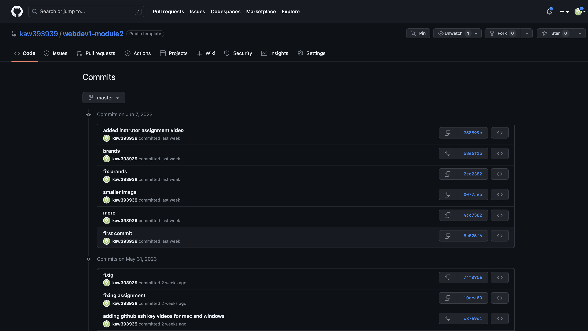

# Your Resume Assignment Submission

For this assignment, you are required to submit a brief description of your work process along with several screenshots. Your submission should demonstrate your understanding of Git version control, responsive design, and CSS techniques used for creating your custom resume. 

Your Readme should contain the following sections:

## Your Resume Design Process

Write a brief summary detailing your workflow and decision-making process as you updated the resume. Highlight the CSS techniques and properties you used, and why you chose them. Describe any challenges you encountered and how you addressed them.

## Commit History 

To successfully complete this assignment, you are required to maintain an active commit history. Each commit message should accurately represent the changes made to your project. Your commit history should mirror the steps outlined in [the Git assignment](assignment.md), where we asked for at least 10 specific commits. 

Include a screenshot of your commit history for this assignment. Your commit history can be accessed from your GitHub repository by clicking on the "Commits" in the top bar. Make sure the screenshot is clear and legible.

## Screenshots of Your Resume

Include screenshots of your final resume in three different views: 

1. **Print Preview**: Demonstrate how your resume would look when printed. You can access the print preview mode from your browser's settings.

2. **Wide Screen (Desktop View)**: Display how your resume appears on a larger screen. Maximize your browser or use a desktop computer for this view.

3. **Narrow Screen (Mobile View)**: Showcase how your resume responds to narrower screens for mobile compatibility. You can adjust your browser window's size or use your browser's developer tools to emulate a mobile device.

These screenshots should demonstrate the responsiveness of your design and its adaptability to different devices and formats.

By submitting this assignment, you're demonstrating your understanding of professional workflows and practices commonly used in the tech industry. Your ability to apply these practices, and your capability to articulate your process and decision-making, is vital to your development as a tech professional. We look forward to seeing your submissions!
